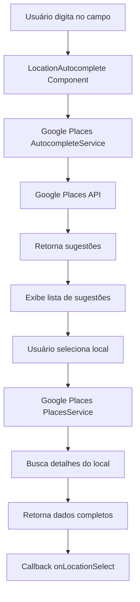
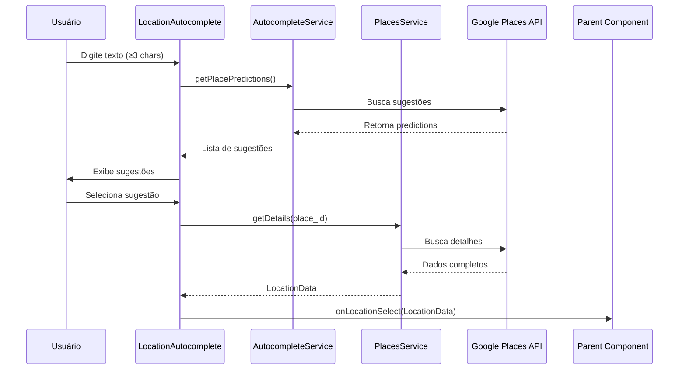

# Requisitos Técnicos - Autocompletar de Endereços com Google Places API

## 1. Visão Geral do Sistema

Este documento detalha os requisitos técnicos para a funcionalidade de autocompletar de endereços integrada à API Google Places, implementada no componente `LocationAutocomplete`.

## 2. Arquitetura do Componente

### 2.1 Diagrama de Arquitetura



### 2.2 Fluxo de Dados



## 3. Especificações Técnicas

### 3.1 Tecnologias Utilizadas

| Tecnologia | Versão | Propósito |
|------------|--------|----------|
| React | 18+ | Framework frontend |
| TypeScript | 5+ | Tipagem estática |
| Google Maps JavaScript API | v3 | Integração com Google Places |
| Vite | 5+ | Build tool e variáveis de ambiente |
| Lucide React | 0.4+ | Ícones da interface |
| Shadcn/ui | Latest | Componentes de UI |

### 3.2 Dependências Externas

```json
{
  "dependencies": {
    "react": "^18.0.0",
    "lucide-react": "^0.400.0"
  },
  "external_apis": {
    "google_maps_js_api": {
      "url": "https://maps.googleapis.com/maps/api/js",
      "libraries": ["places"],
      "language": "pt-BR",
      "region": "BR"
    }
  }
}
```

## 4. Interface e Tipos TypeScript

### 4.1 Definições de Tipos

```typescript
// Tipo para predições do Google Places
interface PlacePrediction {
  place_id: string;
  description: string;
  structured_formatting: {
    main_text: string;
    secondary_text: string;
  };
}

// Tipo para dados de localização retornados
interface LocationData {
  name: string;        // Nome do estabelecimento
  address: string;     // Endereço formatado completo
  place_id: string;    // Identificador único do Google
}

// Props do componente
interface LocationAutocompleteProps {
  onLocationSelect: (location: LocationData) => void;
  initialLocation?: string;
  initialAddress?: string;
  disabled?: boolean;
}

// Extensão global para Google Maps
declare global {
  interface Window {
    google: any;
    initGooglePlaces: () => void;
  }
}
```

### 4.2 Estados do Componente

```typescript
const [query, setQuery] = useState<string>(initialLocation);
const [predictions, setPredictions] = useState<PlacePrediction[]>([]);
const [showSuggestions, setShowSuggestions] = useState<boolean>(false);
const [isLoading, setIsLoading] = useState<boolean>(false);
const [googleLoaded, setGoogleLoaded] = useState<boolean>(false);
```

## 5. Configuração da API Google Places

### 5.1 Parâmetros de Configuração

```typescript
const GOOGLE_MAPS_CONFIG = {
  apiKey: import.meta.env.VITE_GOOGLE_PLACES_API_KEY,
  libraries: ['places'],
  language: 'pt-BR',
  region: 'BR',
  url: 'https://maps.googleapis.com/maps/api/js'
};

const AUTOCOMPLETE_CONFIG = {
  componentRestrictions: { country: 'br' },
  types: ['establishment', 'geocode'],
  maxResults: 5,
  minQueryLength: 3
};
```

### 5.2 Carregamento Dinâmico da API

```typescript
const loadGooglePlaces = async (): Promise<void> => {
  // Verifica se já está carregado
  if (window.google?.maps) {
    initializeServices();
    return;
  }

  // Cria script tag dinamicamente
  const script = document.createElement('script');
  script.src = buildGoogleMapsUrl();
  script.async = true;
  script.defer = true;
  script.onload = initializeServices;
  
  document.head.appendChild(script);
};
```

## 6. Funcionalidades Implementadas

### 6.1 Busca de Sugestões

```typescript
const searchPlaces = async (input: string): Promise<void> => {
  if (!validateSearchConditions(input)) {
    setPredictions([]);
    return;
  }

  setIsLoading(true);

  const request = {
    input,
    componentRestrictions: { country: 'br' },
    types: ['establishment', 'geocode']
  };

  autocompleteService.getPlacePredictions(
    request,
    handlePredictionsResponse
  );
};
```

### 6.2 Seleção de Local

```typescript
const handlePlaceSelect = (prediction: PlacePrediction): void => {
  const request = {
    placeId: prediction.place_id,
    fields: ['name', 'formatted_address', 'place_id']
  };

  placesService.getDetails(request, (place, status) => {
    if (status === google.maps.places.PlacesServiceStatus.OK) {
      const locationData: LocationData = {
        name: place.name || prediction.structured_formatting.main_text,
        address: place.formatted_address || prediction.description,
        place_id: place.place_id
      };
      
      onLocationSelect(locationData);
    }
  });
};
```

## 7. Otimizações de Performance

### 7.1 Estratégias Implementadas

| Otimização | Implementação | Benefício |
|------------|---------------|----------|
| Debounce implícito | Busca apenas com ≥3 caracteres | Reduz chamadas à API |
| Limite de resultados | Máximo 5 sugestões | Melhora performance da UI |
| Cache de serviços | Reutilização de instâncias | Evita recriação desnecessária |
| Carregamento lazy | Script carregado sob demanda | Reduz bundle inicial |
| Cleanup de eventos | useEffect cleanup | Previne memory leaks |

### 7.2 Métricas de Performance

```typescript
// Configurações de performance
const PERFORMANCE_CONFIG = {
  minQueryLength: 3,        // Caracteres mínimos para busca
  maxResults: 5,            // Máximo de sugestões
  debounceDelay: 0,         // Sem debounce adicional
  cacheTimeout: 300000,     // 5 minutos de cache
  requestTimeout: 5000      // 5 segundos timeout
};
```

## 8. Tratamento de Erros

### 8.1 Cenários de Erro

```typescript
const handleApiError = (status: string): void => {
  const errorMessages = {
    'ZERO_RESULTS': 'Nenhum resultado encontrado',
    'OVER_QUERY_LIMIT': 'Limite de consultas excedido',
    'REQUEST_DENIED': 'Acesso negado à API',
    'INVALID_REQUEST': 'Requisição inválida',
    'UNKNOWN_ERROR': 'Erro desconhecido'
  };
  
  console.error('Google Places API Error:', errorMessages[status] || status);
};
```

### 8.2 Fallbacks

```typescript
const fallbackBehavior = {
  noApiKey: () => console.warn('Google Places API key não configurada'),
  apiLoadFailed: () => setGoogleLoaded(false),
  noResults: () => setPredictions([]),
  networkError: () => setIsLoading(false)
};
```

## 9. Segurança e Configuração

### 9.1 Variáveis de Ambiente

```env
# .env.local
VITE_GOOGLE_PLACES_API_KEY=AIzaSyC...
```

### 9.2 Restrições de Segurança

```typescript
// Configurações recomendadas no Google Cloud Console
const SECURITY_CONFIG = {
  httpReferrers: [
    'localhost:*',
    'yourdomain.com/*',
    '*.yourdomain.com/*'
  ],
  apiRestrictions: ['Places API'],
  quotaLimits: {
    requestsPerDay: 1000,
    requestsPerMinute: 100
  }
};
```

## 10. Testes e Validação

### 10.1 Casos de Teste

```typescript
// Casos de teste recomendados
const testCases = [
  {
    name: 'Busca com menos de 3 caracteres',
    input: 'ab',
    expected: 'Não deve fazer busca'
  },
  {
    name: 'Busca válida',
    input: 'restaurante',
    expected: 'Deve retornar sugestões'
  },
  {
    name: 'Seleção de local',
    action: 'click_suggestion',
    expected: 'Deve chamar onLocationSelect'
  },
  {
    name: 'API key inválida',
    scenario: 'invalid_key',
    expected: 'Deve mostrar erro'
  }
];
```

### 10.2 Validações de Dados

```typescript
const validateLocationData = (data: LocationData): boolean => {
  return !!
    data.name &&
    data.address &&
    data.place_id &&
    data.place_id.length > 0;
};
```

## 11. Monitoramento e Logs

### 11.1 Métricas de Uso

```typescript
const trackUsage = {
  searchPerformed: (query: string) => {
    console.log('Search performed:', { query, timestamp: Date.now() });
  },
  locationSelected: (location: LocationData) => {
    console.log('Location selected:', { location, timestamp: Date.now() });
  },
  apiError: (error: string) => {
    console.error('API Error:', { error, timestamp: Date.now() });
  }
};
```

## 12. Roadmap de Melhorias

### 12.1 Funcionalidades Futuras

| Funcionalidade | Prioridade | Estimativa | Descrição |
|----------------|------------|------------|----------|
| Cache local | Alta | 1 semana | Armazenar resultados recentes |
| Geolocalização | Média | 2 semanas | Priorizar resultados próximos |
| Histórico | Baixa | 1 semana | Salvar locais recentes |
| Validação offline | Baixa | 3 dias | Verificar dados sem API |

### 12.2 Otimizações Técnicas

- **Debounce configurável**: Permitir ajustar delay de busca
- **Retry automático**: Tentar novamente em caso de erro
- **Prefetch**: Carregar dados antecipadamente
- **Service Worker**: Cache offline de resultados

Este documento fornece uma visão técnica completa da implementação do autocompletar de endereços, servindo como referência para desenvolvimento e manutenção da funcionalidade.