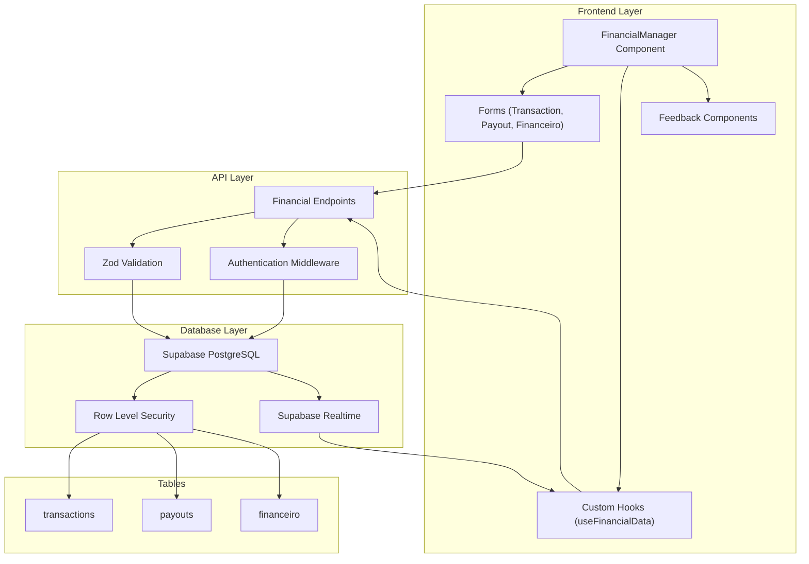
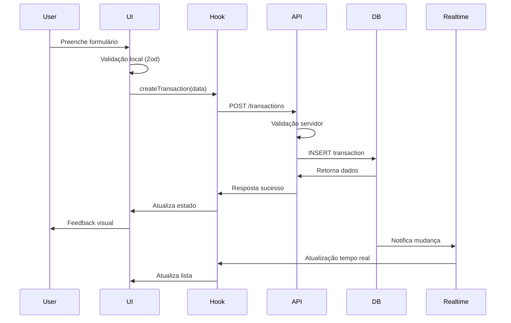
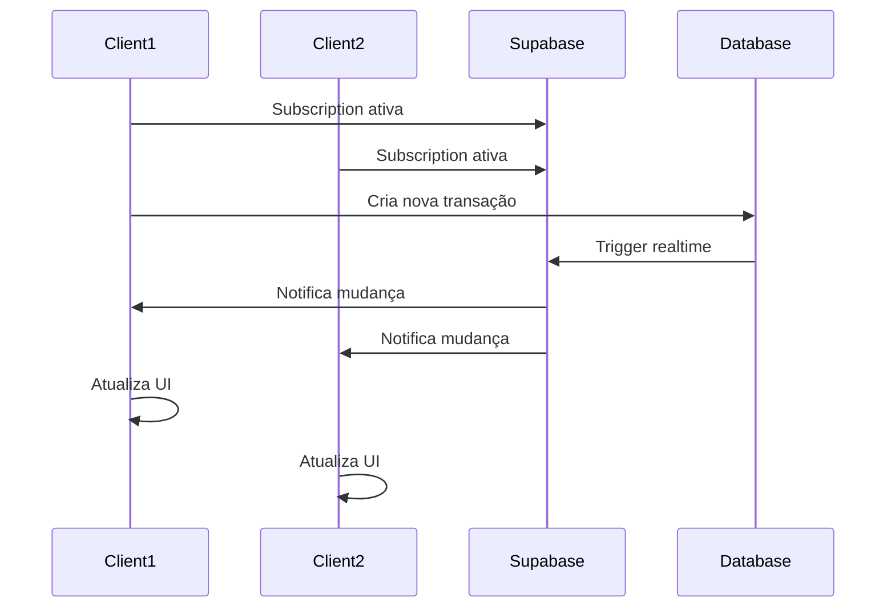
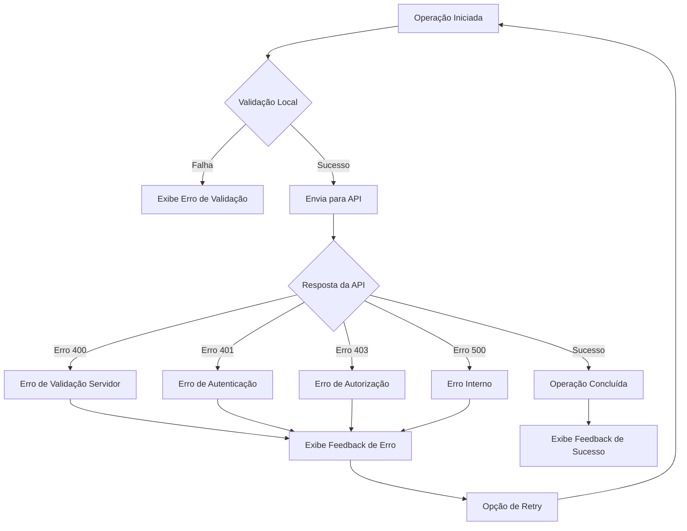

# Documentação do Sistema Financeiro Integrado

## Índice

1. [Visão Geral](#visão-geral)
2. [Arquitetura do Sistema](#arquitetura-do-sistema)
3. [Estrutura do Banco de Dados](#estrutura-do-banco-de-dados)
4. [Fluxos de Dados](#fluxos-de-dados)
5. [API Endpoints](#api-endpoints)
6. [Componentes Frontend](#componentes-frontend)
7. [Sincronização em Tempo Real](#sincronização-em-tempo-real)
8. [Segurança e Autorização](#segurança-e-autorização)
9. [Tratamento de Erros](#tratamento-de-erros)
10. [Guias de Implementação](#guias-de-implementação)
11. [Troubleshooting](#troubleshooting)

## Visão Geral

O Sistema Financeiro Integrado é uma solução completa para gerenciamento de dados financeiros em aplicações multi-tenant. O sistema oferece:

- **Gestão de Transações**: Controle completo de receitas e despesas
- **Gestão de Payouts**: Gerenciamento de pagamentos e transferências
- **Registros Financeiros**: Controle financeiro específico por eventos
- **Sincronização em Tempo Real**: Atualizações instantâneas via Supabase Realtime
- **Interface Unificada**: Componentes React integrados com feedback visual
- **Segurança Multi-tenant**: Isolamento completo de dados por tenant

### Tecnologias Utilizadas

- **Frontend**: React, TypeScript, Tailwind CSS, shadcn/ui
- **Backend**: Supabase (PostgreSQL + Realtime)
- **Validação**: Zod
- **Estado**: React Hooks customizados
- **Testes**: Jest, Playwright

## Arquitetura do Sistema



## Estrutura do Banco de Dados

### Tabela: `transactions`

```sql
CREATE TABLE public.transactions (
    id UUID PRIMARY KEY DEFAULT gen_random_uuid(),
    tenant_id UUID NOT NULL,
    type VARCHAR(20) NOT NULL CHECK (type IN ('income', 'expense')),
    status VARCHAR(20) NOT NULL CHECK (status IN ('pending', 'processing', 'settled', 'failed', 'cancelled')),
    category VARCHAR(50) NOT NULL,
    gross_amount DECIMAL(10,2) NOT NULL CHECK (gross_amount >= 0),
    net_amount DECIMAL(10,2) NOT NULL CHECK (net_amount >= 0),
    transaction_date TIMESTAMP WITH TIME ZONE NOT NULL,
    payment_method VARCHAR(50),
    description TEXT,
    reference_id VARCHAR(100),
    created_at TIMESTAMP WITH TIME ZONE DEFAULT NOW(),
    updated_at TIMESTAMP WITH TIME ZONE DEFAULT NOW()
);
```

**Campos Principais:**
- `id`: Identificador único da transação
- `tenant_id`: ID do tenant (isolamento multi-tenant)
- `type`: Tipo da transação (income/expense)
- `status`: Status atual da transação
- `gross_amount`: Valor bruto da transação
- `net_amount`: Valor líquido após taxas
- `transaction_date`: Data da transação
- `payment_method`: Método de pagamento utilizado

### Tabela: `payouts`

```sql
CREATE TABLE public.payouts (
    id UUID PRIMARY KEY DEFAULT gen_random_uuid(),
    tenant_id UUID NOT NULL,
    beneficiary_type VARCHAR(50) NOT NULL,
    status VARCHAR(20) NOT NULL CHECK (status IN ('pending', 'processing', 'settled', 'failed', 'cancelled')),
    amount DECIMAL(10,2) NOT NULL CHECK (amount > 0),
    due_date DATE NOT NULL,
    payment_method VARCHAR(50),
    description TEXT,
    event_id UUID,
    created_at TIMESTAMP WITH TIME ZONE DEFAULT NOW(),
    updated_at TIMESTAMP WITH TIME ZONE DEFAULT NOW()
);
```

**Campos Principais:**
- `beneficiary_type`: Tipo de beneficiário (band_member, venue, service_provider)
- `amount`: Valor do payout
- `due_date`: Data de vencimento do pagamento
- `event_id`: Referência ao evento relacionado

### Tabela: `financeiro`

```sql
CREATE TABLE public.financeiro (
    id UUID PRIMARY KEY DEFAULT gen_random_uuid(),
    tenant_id UUID NOT NULL,
    evento_id UUID,
    tipo VARCHAR(20) NOT NULL CHECK (tipo IN ('receita', 'despesa')),
    valor DECIMAL(10,2) NOT NULL,
    descricao TEXT,
    data_transacao DATE NOT NULL,
    created_at TIMESTAMP WITH TIME ZONE DEFAULT NOW()
);
```

**Campos Principais:**
- `evento_id`: Referência ao evento relacionado
- `tipo`: Tipo do registro (receita/despesa)
- `valor`: Valor do registro financeiro
- `data_transacao`: Data da transação

### Políticas RLS (Row Level Security)

```sql
-- Transactions
CREATE POLICY "Users can view own tenant transactions" ON public.transactions
    FOR SELECT USING (tenant_id = auth.jwt() ->> 'tenant_id');

CREATE POLICY "Users can insert own tenant transactions" ON public.transactions
    FOR INSERT WITH CHECK (tenant_id = auth.jwt() ->> 'tenant_id');

CREATE POLICY "Users can update own tenant transactions" ON public.transactions
    FOR UPDATE USING (tenant_id = auth.jwt() ->> 'tenant_id');

CREATE POLICY "Users can delete own tenant transactions" ON public.transactions
    FOR DELETE USING (tenant_id = auth.jwt() ->> 'tenant_id');
```

## Fluxos de Dados

### 1. Fluxo de Criação de Transação



### 2. Fluxo de Sincronização em Tempo Real



### 3. Fluxo de Tratamento de Erros



## API Endpoints

### Transactions

#### GET /api/transactions
**Descrição**: Lista transações com filtros e paginação

**Parâmetros de Query:**
```typescript
interface TransactionFilters {
  status?: string;
  type?: string;
  category?: string;
  date_from?: string;
  date_to?: string;
  limit?: number;
  offset?: number;
  search?: string;
}
```

**Resposta:**
```typescript
interface TransactionListResponse {
  data: Transaction[];
  count: number;
  has_more: boolean;
}
```

#### POST /api/transactions
**Descrição**: Cria nova transação

**Body:**
```typescript
interface CreateTransactionRequest {
  type: 'income' | 'expense';
  category: string;
  gross_amount: number;
  net_amount: number;
  transaction_date: string;
  payment_method?: string;
  description?: string;
  reference_id?: string;
}
```

#### PUT /api/transactions/:id
**Descrição**: Atualiza transação existente

**Body:** Partial<CreateTransactionRequest>

#### DELETE /api/transactions/:id
**Descrição**: Remove transação

### Payouts

#### GET /api/payouts
**Descrição**: Lista payouts com filtros

#### POST /api/payouts
**Descrição**: Cria novo payout

**Body:**
```typescript
interface CreatePayoutRequest {
  beneficiary_type: 'band_member' | 'venue' | 'service_provider';
  amount: number;
  due_date: string;
  payment_method?: string;
  description?: string;
  event_id?: string;
}
```

### Financeiro

#### GET /api/financeiro
**Descrição**: Lista registros financeiros

#### POST /api/financeiro
**Descrição**: Cria novo registro financeiro

**Body:**
```typescript
interface CreateFinanceiroRequest {
  tipo: 'receita' | 'despesa';
  valor: number;
  descricao?: string;
  data_transacao: string;
  evento_id?: string;
}
```

## Componentes Frontend

### FinancialManager
**Arquivo**: `src/components/financial/FinancialManager.tsx`

**Responsabilidades:**
- Gerenciamento de estado global dos dados financeiros
- Coordenação entre diferentes abas (Transactions, Payouts, Financeiro)
- Controle de modais e formulários
- Feedback visual e tratamento de erros

**Props:**
```typescript
interface FinancialManagerProps {
  defaultTab?: 'transactions' | 'payouts' | 'financeiro';
  className?: string;
}
```

### Formulários

#### TransactionForm
**Arquivo**: `src/components/financial/TransactionForm.tsx`

**Funcionalidades:**
- Validação em tempo real com Zod
- Cálculo automático de valores líquidos
- Suporte a diferentes modos (create/edit/view)
- Feedback visual de validação

#### PayoutForm
**Arquivo**: `src/components/financial/PayoutForm.tsx`

**Funcionalidades:**
- Gestão de beneficiários
- Controle de datas de vencimento
- Validação de valores

#### FinanceiroForm
**Arquivo**: `src/components/financial/FinanceiroForm.tsx`

**Funcionalidades:**
- Controle de receitas e despesas
- Associação com eventos
- Resumo de transação

### Hooks Customizados

#### useFinancialData
**Arquivo**: `src/components/financial/useFinancialData.ts`

**Hooks Disponíveis:**
- `useTransactions()`: Gerenciamento de transações
- `usePayouts()`: Gerenciamento de payouts
- `useFinanceiro()`: Gerenciamento de registros financeiros
- `useDashboardMetrics()`: Métricas do dashboard

**Funcionalidades Comuns:**
```typescript
interface FinancialHook<T> {
  data: T[];
  loading: boolean;
  error: string | null;
  create: (data: CreateData) => Promise<T>;
  update: (id: string, data: UpdateData) => Promise<T>;
  delete: (id: string) => Promise<void>;
  refresh: () => Promise<void>;
}
```

### Componentes de Feedback

#### OperationStatus
**Arquivo**: `src/components/financial/FinancialFeedback.tsx`

**Estados Suportados:**
- `loading`: Operação em andamento
- `success`: Operação bem-sucedida
- `error`: Erro na operação
- `warning`: Atenção necessária

#### ConfirmationModal
**Arquivo**: `src/components/financial/ConfirmationModal.tsx`

**Funcionalidades:**
- Confirmação de ações destrutivas
- Exibição de detalhes do item
- Diferentes variantes (destructive, warning, default)
- Hook `useConfirmation()` para facilitar uso

## Sincronização em Tempo Real

### Configuração

```typescript
// Configuração da subscription
const subscription = supabase
  .channel('financial-changes')
  .on(
    'postgres_changes',
    {
      event: '*',
      schema: 'public',
      table: 'transactions'
    },
    (payload) => {
      handleRealtimeUpdate(payload);
    }
  )
  .subscribe();
```

### Tratamento de Eventos

```typescript
const handleRealtimeUpdate = (payload: RealtimePayload) => {
  switch (payload.eventType) {
    case 'INSERT':
      setTransactions(prev => [payload.new, ...prev]);
      break;
    case 'UPDATE':
      setTransactions(prev => 
        prev.map(t => t.id === payload.new.id ? payload.new : t)
      );
      break;
    case 'DELETE':
      setTransactions(prev => 
        prev.filter(t => t.id !== payload.old.id)
      );
      break;
  }
};
```

### Otimizações

1. **Debouncing**: Evita atualizações excessivas
2. **Filtros**: Apenas mudanças relevantes ao tenant
3. **Cleanup**: Unsubscribe automático no unmount
4. **Error Handling**: Reconexão automática em caso de falha

## Segurança e Autorização

### Autenticação

```typescript
// Middleware de autenticação
const authMiddleware = async (req: Request, res: Response, next: NextFunction) => {
  const token = req.headers.authorization?.replace('Bearer ', '');
  
  if (!token) {
    return res.status(401).json({ error: 'Authentication required' });
  }
  
  try {
    const { data: user, error } = await supabase.auth.getUser(token);
    
    if (error || !user) {
      return res.status(401).json({ error: 'Invalid token' });
    }
    
    req.user = user;
    next();
  } catch (error) {
    return res.status(401).json({ error: 'Authentication failed' });
  }
};
```

### Autorização Multi-tenant

```typescript
// Verificação de tenant
const checkTenantAccess = (req: Request, res: Response, next: NextFunction) => {
  const userTenantId = req.user.app_metadata.tenant_id;
  const requestedTenantId = req.body.tenant_id || req.params.tenant_id;
  
  if (userTenantId !== requestedTenantId) {
    return res.status(403).json({ error: 'Access denied' });
  }
  
  next();
};
```

### Validação de Dados

```typescript
// Middleware de validação
const validateRequest = (schema: ZodSchema) => {
  return (req: Request, res: Response, next: NextFunction) => {
    try {
      schema.parse(req.body);
      next();
    } catch (error) {
      if (error instanceof ZodError) {
        return res.status(400).json({
          error: 'Validation failed',
          details: error.errors
        });
      }
      next(error);
    }
  };
};
```

## Tratamento de Erros

### Hierarquia de Erros

```typescript
// Classes de erro customizadas
class FinancialError extends Error {
  constructor(
    message: string,
    public code: string,
    public statusCode: number = 500
  ) {
    super(message);
    this.name = 'FinancialError';
  }
}

class ValidationError extends FinancialError {
  constructor(message: string, public details?: any) {
    super(message, 'VALIDATION_ERROR', 400);
  }
}

class NotFoundError extends FinancialError {
  constructor(resource: string) {
    super(`${resource} not found`, 'NOT_FOUND', 404);
  }
}

class UnauthorizedError extends FinancialError {
  constructor(message: string = 'Unauthorized') {
    super(message, 'UNAUTHORIZED', 401);
  }
}
```

### Handler Global de Erros

```typescript
const errorHandler = (error: Error, req: Request, res: Response, next: NextFunction) => {
  console.error('Error:', error);
  
  if (error instanceof FinancialError) {
    return res.status(error.statusCode).json({
      error: error.message,
      code: error.code,
      ...(error instanceof ValidationError && { details: error.details })
    });
  }
  
  // Erro não tratado
  res.status(500).json({
    error: 'Internal server error',
    code: 'INTERNAL_ERROR'
  });
};
```

### Tratamento no Frontend

```typescript
const handleApiError = (error: any) => {
  if (error.response) {
    const { status, data } = error.response;
    
    switch (status) {
      case 400:
        toast.error(data.error || 'Dados inválidos');
        break;
      case 401:
        toast.error('Sessão expirada. Faça login novamente.');
        // Redirect to login
        break;
      case 403:
        toast.error('Acesso negado');
        break;
      case 404:
        toast.error('Recurso não encontrado');
        break;
      case 500:
        toast.error('Erro interno do servidor');
        break;
      default:
        toast.error('Erro inesperado');
    }
  } else {
    toast.error('Erro de conexão');
  }
};
```

## Guias de Implementação

### 1. Adicionando Nova Funcionalidade

#### Passo 1: Definir Schema de Validação
```typescript
// schemas/newFeature.ts
export const newFeatureSchema = z.object({
  name: z.string().min(1, 'Nome é obrigatório'),
  value: z.number().positive('Valor deve ser positivo'),
  // ... outros campos
});

export type NewFeatureData = z.infer<typeof newFeatureSchema>;
```

#### Passo 2: Criar Endpoint
```typescript
// endpoints/newFeature.ts
export const createNewFeature = async (data: NewFeatureData) => {
  const validatedData = newFeatureSchema.parse(data);
  
  const { data: result, error } = await supabase
    .from('new_feature_table')
    .insert(validatedData)
    .select()
    .single();
    
  if (error) throw new FinancialError(error.message, 'CREATE_FAILED');
  return result;
};
```

#### Passo 3: Criar Hook
```typescript
// hooks/useNewFeature.ts
export const useNewFeature = () => {
  const [data, setData] = useState<NewFeatureData[]>([]);
  const [loading, setLoading] = useState(false);
  const [error, setError] = useState<string | null>(null);
  
  // Implementar CRUD operations
  // Implementar real-time subscription
  
  return { data, loading, error, create, update, delete, refresh };
};
```

#### Passo 4: Criar Componente
```typescript
// components/NewFeatureForm.tsx
export const NewFeatureForm: React.FC<NewFeatureFormProps> = ({
  mode,
  initialData,
  onSubmit,
  onCancel
}) => {
  // Implementar formulário com validação
  // Implementar feedback visual
  // Implementar diferentes modos (create/edit/view)
};
```

### 2. Adicionando Validação Customizada

```typescript
// Validação customizada com Zod
const customValidation = z.object({
  amount: z.number()
    .positive('Valor deve ser positivo')
    .refine(val => val <= 1000000, 'Valor máximo excedido'),
  
  date: z.string()
    .refine(val => new Date(val) <= new Date(), 'Data não pode ser futura'),
    
  email: z.string()
    .email('Email inválido')
    .refine(async (email) => {
      // Validação assíncrona
      const exists = await checkEmailExists(email);
      return !exists;
    }, 'Email já está em uso')
});
```

### 3. Implementando Cache

```typescript
// Cache com React Query
import { useQuery, useMutation, useQueryClient } from '@tanstack/react-query';

export const useTransactionsWithCache = () => {
  const queryClient = useQueryClient();
  
  const {
    data: transactions,
    isLoading,
    error
  } = useQuery({
    queryKey: ['transactions'],
    queryFn: fetchTransactions,
    staleTime: 5 * 60 * 1000, // 5 minutos
    cacheTime: 10 * 60 * 1000 // 10 minutos
  });
  
  const createMutation = useMutation({
    mutationFn: createTransaction,
    onSuccess: () => {
      queryClient.invalidateQueries(['transactions']);
    }
  });
  
  return {
    transactions,
    isLoading,
    error,
    createTransaction: createMutation.mutate
  };
};
```

## Troubleshooting

### Problemas Comuns

#### 1. Erro de Conexão com Supabase

**Sintomas:**
- Timeout nas requisições
- Erro "Network Error"
- Dados não carregam

**Soluções:**
```typescript
// Verificar configuração
const supabase = createClient(
  process.env.NEXT_PUBLIC_SUPABASE_URL!,
  process.env.NEXT_PUBLIC_SUPABASE_ANON_KEY!,
  {
    auth: {
      persistSession: true,
      autoRefreshToken: true
    },
    realtime: {
      params: {
        eventsPerSecond: 10
      }
    }
  }
);

// Implementar retry logic
const retryRequest = async (fn: () => Promise<any>, maxRetries = 3) => {
  for (let i = 0; i < maxRetries; i++) {
    try {
      return await fn();
    } catch (error) {
      if (i === maxRetries - 1) throw error;
      await new Promise(resolve => setTimeout(resolve, 1000 * (i + 1)));
    }
  }
};
```

#### 2. Problemas de Performance

**Sintomas:**
- Interface lenta
- Muitas re-renderizações
- Consumo excessivo de memória

**Soluções:**
```typescript
// Otimizar re-renderizações
const MemoizedComponent = React.memo(Component, (prevProps, nextProps) => {
  return prevProps.data.length === nextProps.data.length;
});

// Implementar paginação
const usePaginatedData = (pageSize = 50) => {
  const [page, setPage] = useState(0);
  const [allData, setAllData] = useState([]);
  
  const paginatedData = useMemo(() => {
    const start = page * pageSize;
    return allData.slice(start, start + pageSize);
  }, [allData, page, pageSize]);
  
  return { paginatedData, page, setPage, hasMore: (page + 1) * pageSize < allData.length };
};

// Debounce para buscas
const useDebouncedSearch = (searchTerm: string, delay = 300) => {
  const [debouncedTerm, setDebouncedTerm] = useState(searchTerm);
  
  useEffect(() => {
    const timer = setTimeout(() => setDebouncedTerm(searchTerm), delay);
    return () => clearTimeout(timer);
  }, [searchTerm, delay]);
  
  return debouncedTerm;
};
```

#### 3. Problemas de Sincronização

**Sintomas:**
- Dados desatualizados
- Conflitos de versão
- Perda de atualizações

**Soluções:**
```typescript
// Implementar optimistic updates
const useOptimisticUpdates = () => {
  const [optimisticData, setOptimisticData] = useState([]);
  const [serverData, setServerData] = useState([]);
  
  const addOptimistic = (item) => {
    const tempId = `temp_${Date.now()}`;
    const optimisticItem = { ...item, id: tempId, _optimistic: true };
    setOptimisticData(prev => [optimisticItem, ...prev]);
    
    // Enviar para servidor
    createItem(item)
      .then(serverItem => {
        setOptimisticData(prev => prev.filter(i => i.id !== tempId));
        setServerData(prev => [serverItem, ...prev]);
      })
      .catch(() => {
        setOptimisticData(prev => prev.filter(i => i.id !== tempId));
        toast.error('Falha ao salvar item');
      });
  };
  
  const displayData = [...optimisticData, ...serverData];
  return { displayData, addOptimistic };
};

// Controle de versão
const handleVersionConflict = async (id: string, data: any, version: number) => {
  try {
    await updateWithVersion(id, data, version);
  } catch (error) {
    if (error.code === 'VERSION_CONFLICT') {
      const confirmed = await confirm({
        title: 'Conflito de Versão',
        description: 'Os dados foram modificados por outro usuário. Deseja sobrescrever?'
      });
      
      if (confirmed) {
        await forceUpdate(id, data);
      } else {
        await refreshData();
      }
    }
  }
};
```

### Logs e Monitoramento

```typescript
// Sistema de logs
const logger = {
  info: (message: string, data?: any) => {
    console.log(`[INFO] ${message}`, data);
    // Enviar para serviço de monitoramento
  },
  
  error: (message: string, error?: Error, data?: any) => {
    console.error(`[ERROR] ${message}`, error, data);
    // Enviar para serviço de monitoramento
  },
  
  performance: (operation: string, duration: number) => {
    console.log(`[PERF] ${operation}: ${duration}ms`);
    if (duration > 1000) {
      console.warn(`Slow operation detected: ${operation}`);
    }
  }
};

// Wrapper para operações com logs
const withLogging = <T extends (...args: any[]) => Promise<any>>(fn: T, operationName: string): T => {
  return (async (...args: any[]) => {
    const startTime = Date.now();
    logger.info(`Starting ${operationName}`, { args });
    
    try {
      const result = await fn(...args);
      const duration = Date.now() - startTime;
      logger.performance(operationName, duration);
      logger.info(`Completed ${operationName}`, { result });
      return result;
    } catch (error) {
      const duration = Date.now() - startTime;
      logger.error(`Failed ${operationName}`, error, { args, duration });
      throw error;
    }
  }) as T;
};
```

### Ferramentas de Debug

```typescript
// Debug helper para desenvolvimento
const debugFinancial = {
  logState: (componentName: string, state: any) => {
    if (process.env.NODE_ENV === 'development') {
      console.group(`🔍 ${componentName} State`);
      console.log('State:', state);
      console.groupEnd();
    }
  },
  
  logApiCall: (endpoint: string, data?: any) => {
    if (process.env.NODE_ENV === 'development') {
      console.group(`🌐 API Call: ${endpoint}`);
      console.log('Data:', data);
      console.log('Timestamp:', new Date().toISOString());
      console.groupEnd();
    }
  },
  
  logRealtimeEvent: (event: any) => {
    if (process.env.NODE_ENV === 'development') {
      console.group('⚡ Realtime Event');
      console.log('Event:', event);
      console.log('Timestamp:', new Date().toISOString());
      console.groupEnd();
    }
  }
};
```

## Conclusão

Este sistema financeiro integrado oferece uma solução completa e robusta para gerenciamento de dados financeiros em aplicações multi-tenant. Com arquitetura bem definida, segurança implementada e documentação abrangente, o sistema está preparado para produção e futuras expansões.

### Próximos Passos

1. **Implementação dos Testes**: Seguir a estratégia definida no documento de testes
2. **Monitoramento**: Implementar dashboards de monitoramento e alertas
3. **Performance**: Otimizações baseadas em métricas de produção
4. **Funcionalidades Avançadas**: Relatórios, exportação, integrações externas

### Suporte

Para dúvidas ou problemas:
1. Consulte esta documentação
2. Verifique os logs de erro
3. Execute os testes relacionados
4. Consulte a equipe de desenvolvimento